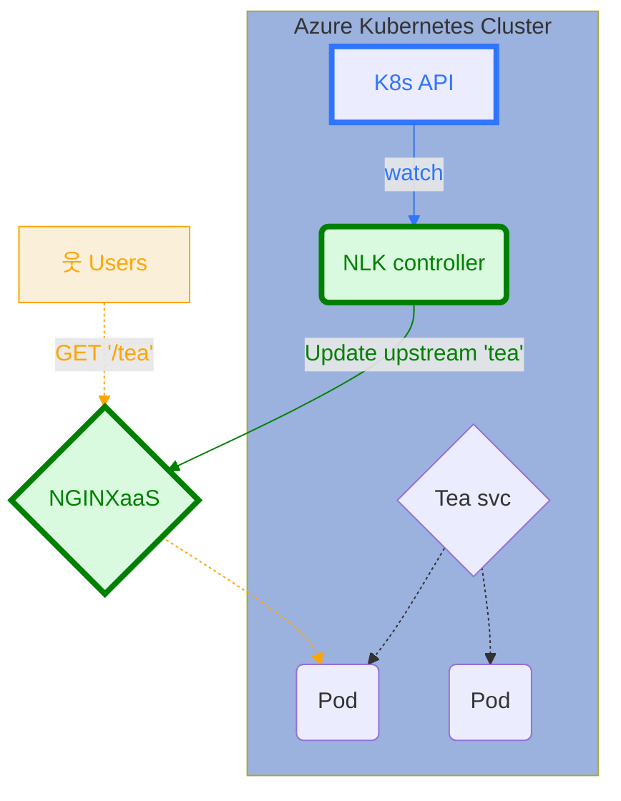
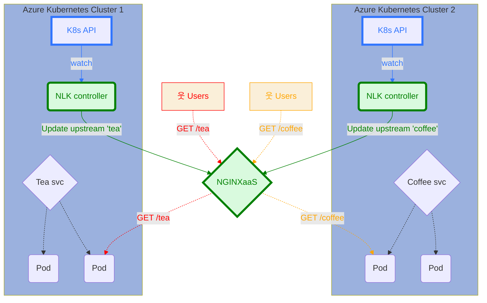

## Overview

F5 NGINXaaS for Azure simplifies advanced Layer 4 and Layer 7 load balancing for Kubernetes clusters. With the NGINX Load Balancer for Kubernetes (NLK) feature, you can enable multi-cluster load balancing, failover, disaster recovery, and blue-green or canary deployments.

<style type="text/css">
   .markdown-node-label {
      text-align: left;
   }
</style>



The NLK controller monitors [Kubernetes Services](https://kubernetes.io/docs/concepts/services-networking/service/) and updates an [NGINX Upstream](https://nginx.org/en/docs/http/ngx_http_upstream_module.html) dynamically. NGINXaaS applies these updates immediately and keeps them in sync during scaling or upgrades.

### Example use cases

- You can use NGINXaaS for Azure to enforce rate limiting and application security with NGINX App Protect, then forward all accepted traffic to your Kubernetes applications.
- You can use NGINXaaS for Azure to receive traffic on `api.example.com` and route requests by URL path - for example, forwarding `/login` to a Kubernetes-based login service, `/graph` to a Kubernetes-hosted graph service, and `/process` to an application server on a standalone VM.

## Getting Started

This guide explains how to integrate NGINXaaS with an Azure Kubernetes Service (AKS) cluster. See [Advanced Configuration](#advanced-configuration) for options to customize the installation..

Before following the steps in this guide, you must:

- Create an AKS cluster.
- Create an NGINXaaS deployment. See the [documentation]() to deploy via the Azure portal.
- Ensure network connectivity between the subnet delegated to the NGINXaaS deployment and the subnet where AKS is deployed. For example, the AKS cluster and NGINXaaS deployment can run on the same Azure VNET or on peered VNETs.

### Initial setup

The steps in this section must be completed once for each new setup. We will install the NLK controller in the Kubernetes cluster and authorize that to send updates to the NGINXaaS deployment.

1. Create an NGINXaaS data plane API key.
1. Look up the NGINXaaS data plane API endpoint.
1. Install the NLK controller.

#### Create an NGINXaaS data plane API key


The data plane API key has the following requirements:
- The key should have an expiration date. The default expiration date is six months from the date of creation. The expiration date cannot be longer than two years from the date of creation.
- The key should be at least 12 characters long.
- The key requires three out of four of the following types of characters:
  - lowercase characters.
  - uppercase characters.
  - symbols.
  - numbers.

A good example of an API key that will satisfy the requirements is UUIDv4.



The data plane API key can be created using the Azure CLI or portal.

##### Create an NGINXaaS data plane API key using the Azure portal

1. Go to your NGINXaaS for Azure deployment.
1. Select **NGINXaaS Loadbalancer for Kubernetes** on the left blade.
1. Select **New API Key**.
1. Provide a name for the new API key in the right panel, and select an expiration date.
1. Select the **Add API Key** button.
1. Copy the value of the new API key.


Make sure to write down the key value in a safe location after creation, as you cannot retrieve it again. If you lose the generated value, delete the existing key and create a new one.


##### Create an NGINXaaS data plane API key using the Azure CLI

Set shell variables about the name of the NGINXaaS you've already created:

```bash
## Customize this to provide the details about my already created NGINXaaS deployment
nginxName=myNginx
nginxGroup=myNginxGroup
```

Generate a new random data plane API key:

```bash
# Generate a new random key or specify a value for it.
keyName=myKey
keyValue=$(uuidgen --random)
```

Create the key for your NGINXaaS deployment:

```bash
az nginx deployment api-key create --name $keyName --secret-text $keyValue --deployment-name $nginxName --resource-group  $nginxGroup
```

#### NGINXaaS data plane API endpoint

The data plane API endpoint can be retrieved using the Azure CLI or portal.

##### View NGINXaaS data plane API endpoint using the Azure portal

1. Go to your NGINXaaS for Azure deployment.
1. Select **NGINXaaS Loadbalancer for Kubernetes** on the left blade.
1. The data plane API endpoint associated with the deployment is available at the top of the screen.

##### View NGINXaaS data plane API endpoint using the Azure CLI

```bash
dataplaneAPIEndpoint=$(az nginx deployment show -g "$nginxGroup" -n "$nginxName" --query properties.dataplaneApiEndpoint -o tsv)
```

#### Install the NLK controller

The NLK controller can be installed in your Kubernetes cluster using either Helm or the official [AKS Extension](https://azuremarketplace.microsoft.com/en-us/marketplace/apps/f5-networks.f5-nginx-for-azure-aks-extension?tab=overview) available on the Azure Marketplace.

##### Install the NLK controller using Helm

Install the NLK controller using `helm install`. Be sure your kubectl context is pointed at the desired cluster.

```bash
helm install nlk oci://registry-1.docker.io/nginxcharts/nginxaas-loadbalancer-kubernetes --version 1.0.0 \
  --set "nlk.dataplaneApiKey=${keyValue}" \
  --set "nlk.config.nginxHosts=${dataplaneAPIEndpoint}nplus"
```

##### Install the AKS Extension using the Azure CLI

Install the NLK controller using `az k8s-extension`.

```bash
## Customize this to provide the details about my already created AKS cluster
aksName=myCluster
aksGroup=myClusterGroup
az k8s-extension create \
  --name nlk \
  --extension-type "nginxinc.nginxaas-aks-extension" \
  --scope cluster \
  --cluster-name ${aksName} \
  --resource-group ${aksGroup} \
  --cluster-type managedClusters \
  --plan-name f5-nginx-for-azure-aks-extension \
  --plan-product f5-nginx-for-azure-aks-extension \
  --plan-publisher f5-networks \
  --release-namespace nlk \
  --config nlk.dataplaneApiKey=${keyValue} \
  --config nlk.config.nginxHosts=${dataplaneAPIEndpoint}nplus
```

##### Install the AKS Extension using the Azure portal

You can also install the NLK controller AKS extension by navigating to [F5 NGINXaaS Loadbalancer for Kubernetes](https://azuremarketplace.microsoft.com/en-us/marketplace/apps/f5-networks.f5-nginx-for-azure-aks-extension) in the Azure Marketplace and following the installation steps.

- Select **Get it now**.
- Select **Continue** to proceed with the installation.
- On the **Basics** tab, provide the following information:

  
  | Field                       | Description                |
  |---------------------------- | ---------------------------- |
  | Subscription                | Select the appropriate Azure subscription. |
  | Resource group              | Select the AKS cluster's resource group.   |
  

- Select **Cluster Details**, and provide the AKS cluster name. You can select an existing AKS cluster or create a new one.
- Select **Application Details**, and provide the following information:

  
  | Field                       | Description                |
  |---------------------------- | ---------------------------- |
  | Cluster extension resource name             | Provide a name for the NLK controller.             |
  | Installation namespace                      | Provide the AKS namespace for the NLK controller.  |
  | Allow minor version upgrades of extension   | Select whether to allow the extension to be upgraded automatically to the latest minor version.   |
  | NGINXaaS Dataplane API Key                  | Provide the previously generated data plane API key value: `{keyValue}`                            |
  | NGINXaaS Dataplane API Endpoint             | Provide the previously retrieved data plane API endpoint value:  `{dataplaneAPIEndpoint}nplus`     |
  

- Select **Review + Create** to continue.
- Azure will validate the extension settings. This page will provide a summary of the provided information. Select **Create**.


The NGINXaaS data plane API that NLK uses is mounted at `${dataplaneAPIEndpoint}nplus`. For example, if the data plane API endpoint is `https://mynginx-75b3bf22a555.eastus2.nginxaas.net/` then the value for `nlk.config.nginxHosts` should be `https://mynginx-75b3bf22a555.eastus2.nginxaas.net/nplus`.


### Create an NGINX configuration with dynamic upstream

You must define an [NGINX upstream](https://nginx.org/en/docs/http/ngx_http_upstream_module.html#upstream) that satisfies the following requirements for it to be managed by the NLK controller:

- The upstream cannot have any servers listed in it specified via the `server` directive. The controller will manage the servers dynamically.
- The upstream must have a shared memory [zone](https://nginx.org/en/docs/http/ngx_http_upstream_module.html#zone) defined.
- The upstream must have a [state](https://nginx.org/en/docs/http/ngx_http_upstream_module.html#state) file declared.

The following is an example NGINX Configuration that can be used:

```nginx
http {
  upstream my-service {
    # NOTE: There are no servers defined here as they will be managed dynamically by the controller.
    zone my-service 64K;          # required
    state /tmp/my-service.state;  # required
  }

  server {
    listen 80;
    location / {
        proxy_pass http://my-service;
    }
  }
}
```

[Apply the NGINX configuration]() to your deployment after making the required changes.

### Create a Kubernetes Service

Expose a Kubernetes `Service` to route traffic to your workload.  The `Service` has the following requirements:

- Add the annotation: `nginx.com/nginxaas: nginxaas` to mark the service to be monitored by NLK.
- Choose one of the following `Service` types:
  - `NodePort`: To route external traffic into the cluster using a well defined port exposed on each AKS worker node.
  - `ClusterIP`: To route traffic to pods directly if you are running an Azure Container Networking Interface (CNI) that lets you expose the pods on the Azure VNET.
- The port name must be formatted as `{{NGINX Context}}-{{NGINX upstream name}}`. For example:
  - If the upstream is in the `http` context and named `my-service` then the name is `http-my-service`
  - If the upstream is in the `stream` context and named `jet` then the port name is `stream-jet`

The following example uses a service of type `NodePort`:

```yaml
apiVersion: v1
kind: Service
metadata:
  name: my-service
  annotations:
    # Let the controller know to pay attention to this service.
    # If you are connecting multiple controller the value can be used to distinguish them
    nginx.com/nginxaas: nginxaas
spec:
  # expose a port on the nodes
  type: NodePort
  ports:
    - targetPort: http
      protocol: TCP
      # The port name helps connect to NGINXaaS. It must be prefixed with either `http-` or `stream-`
      # and the rest of the name must match the name of an upstream in that context.
      name: http-my-service
  selector:
    app: awesome
```

## Advanced Configuration

### Controller Configuration

| Helm Value             | Description                                                                 | Value                                     |
|------------------------|----------------------------------------------------------|--------------------------------|
| `nlk.config.logLevel` | How verbose should the NLK controller logs be. | Possible values are `debug`, `info`, `warn`, `error`. Default: `info`. |
| `nlk.config.nginxHosts` | The NGINX Plus APIs to send upstream updates to. | Should be set to `{{dataplaneApiEndpoint}}nplus`.|
| `nlk.config.serviceAnnotationMatch` | The value to match on a Service's `nginx.com/nginxaas` annotation. Useful when configuring multiple NLK controllers to update separate NGINXaaS deployemnts. | Default: `nginxaas`. |
| `nlk.dataplaneApiKey`   | The NGINXaaS data plane API key that will authorize the controller to talk to your NGINXaaS deployment.           |                                                                                         |

### Multiple AKS clusters

A single NGINXaaS deployment can direct trafifc to multiple AKS clusters. Each AKS cluster needs its own copy of NLK installed and connected to NGINXaaS.




- Configuring multiple NLK controllers to update the same upstream isn't supported and will result in unpredictable behavior.


### Multiple NGINXaaS deployments

Multiple NLK controllers can be installed in the same AKS cluster to update separate NGINXaaS deployments.

Each NLK needs a unique helm release name and needs a unique helm value for `nlk.config.serviceAnnotationMatch`.  Each NLK will only watch services that have the matching annotation.


- Consider using `helm` to install multiple NLK controllers on an AKS cluster. Installing multiple copies of the controller on the same AKS cluster is not supported via the [AKS Extension](https://azuremarketplace.microsoft.com/en-us/marketplace/apps/f5-networks.f5-nginx-for-azure-aks-extension?tab=overview).


## Troubleshooting

NGINXaaS Loadbalancer for Kubernetes and NGINXaaS continually monitor and attempt to repair in case of error. However, if upstreams are not populated as expected, here are a few things you can look for.

### NLK controller logs

The controller reports status information about the requests it is making to NGINXaaS. This is a good place to look to ensure that the controller has picked up your service and that it is communicating with NGINXaaS correctly.

Run the following command to view the controller logs: `kubectl logs deployment/nlk-nginxaas-loadbalancer-kubernetes`.

The logs can be made more verbose by setting the Helm value `nlk.config.logLevel` (see [Controller Configuration](#controller-configuration)).

### Enable NGINX Upstream Update Logs

NGINXaaS supports exporting dynamic upstream update logs to an Azure Storage account or to a Log Analytics workspace.

To setup logging:
1. Select **Diagnostic settings** under **Monitoring**.
1. Select **Add diagnostic setting**.
1. On the following panel, provide a **Diagnostic setting name**.
1. Enable the **NGINX Upstream Update Logs** category.
1. Select a destination.

For more information on logging, see [Enable NGINX Logs]().

### Metrics

NGINXaaS has the following metrics that are useful to monitor upstream health:

- `plus.http.upstream.peers.state.up` -- does the peer report being healthy.
- `plus.http.upstream.peers.request.count` -- which peers are handling requests.

See the [metrics catalog](../../monitoring/metrics-catalog) for the entire list of NGINXaaS metrics.
